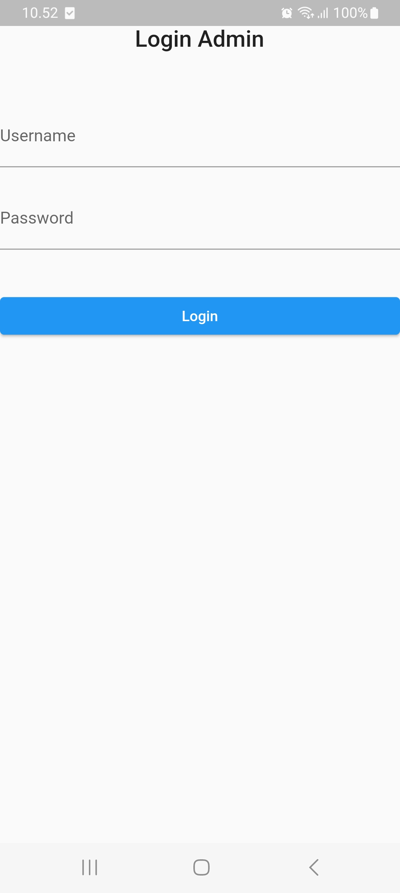
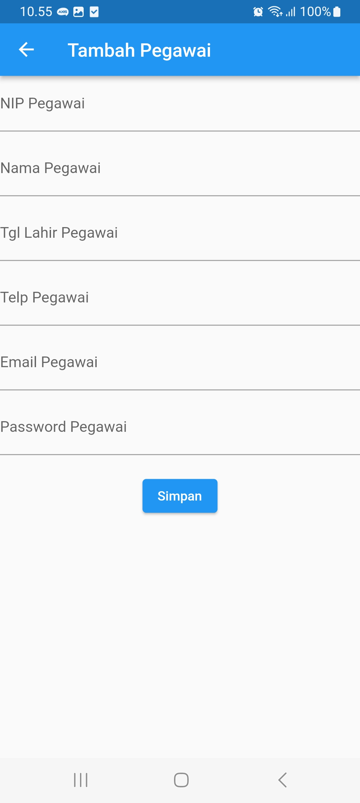

# ❤️ klinik_app

 

Klinik App adalah aplikadi klinik berbais mobile dengab menggunakan franework Flutter,
terdapat 3 menu utama yang terdapat pada aplikasi inibyakni Poli, Pegawai, Pasien.

## 💻 Pengguna Sistem

Pengguna yang dapat mrmakai sistem ini janyalah admin

<ol>
  <li>Admin dapat melakukan login.</li>
  <li>Admin dapat melihat, menambahkan, memperbarui dan menghapus data Poli.</li>
  <li>Admin dapat melihat, menambahkan, memperbarui dan menghapus data Pegawai.</li>
  <li>Admin dapat melihat, menambahkan, memperbarui dan menghapus data Pasien.</li>
  <li>Admin dapat melakukan logout.</li>
</ol>

## 💻 Screnshoot Aplikasi

<table width="100%">
  <tbody>
    <tr>
      <td width="33%">
        <h5 style="text-align; center">Login Form</h5>
         
      </td>
      <td width="33%">
        <h5 style="text-align; center">Form Tambah Pegawai</h5>
         
      </td>
      <td width="33%">
        <h5 style="text-align; center">Form Detail Pasien</h5>
         
      </td>
    </tr>
  </tbody>
</table>

## 📝 Prerequisite

untuk menjalankan aplikasi ini disarnkan untuk menyiapkan aplikasi berikut ini :

- Android Studio Giraffe <code>2022.03.1 patch 1</code>
- Android Studio Giraffe <code>2022.03.1 patch 2</code>
- Android Studio Giraffe <code>2022.03.1 patch 3</code>

## 📜 Credit & License

Project ini mengacu pada modul praktik dari mata kuliah Mobile Programming Universitas Bina Sarana Informatika (UBSI). Project ini bersifat open-source untuk edukasi.

<blockquote>Kuliah...? BSI AJA !!</blockquote>
